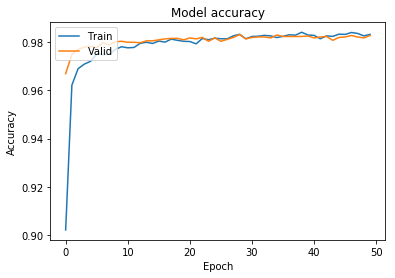
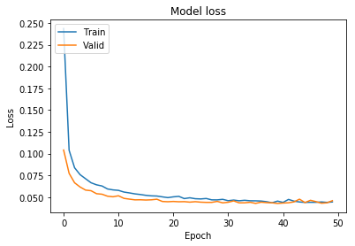
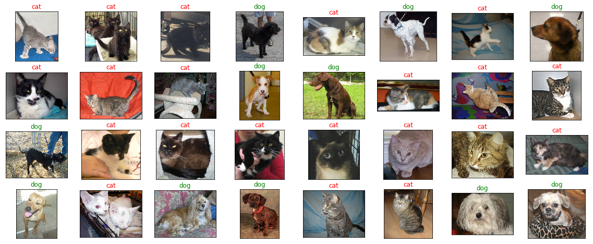

# 猫狗大战（Dogs vs Cats）


## 项目介绍

使用要迁移学习的模型，使用提取的bottleneck特征来训练新模型。

<a id="step0"></a>
## 1. 导入数据集

读取datas目录下的数据集，并分为train和test两类。


```python
import os
from sklearn.datasets import load_files
from keras.utils import np_utils
import numpy as np
from glob import glob

data = load_files('datas')

files = np.array(data['filenames'])
targets = np.array(data['target'])
target_names = np.array(data['target_names'])

test_files = [files[idx] for idx in range(len(files)) if targets[idx] == np.argwhere(target_names == 'test')]

def getFileName(elem):
    _,file = os.path.split(elem)
    name,_ = os.path.splitext(file)
    return int(name)
test_files.sort(key=getFileName)

print("There are {} test images.".format(len(test_files)))
```

    Using TensorFlow backend.


    There are 12500 test images.


<a id="step2"></a>
## 2. 模型预测


### 2.1 构建模型

为了提高模型的训练速度和质量，这里使用迁移学习，主要构建全连接层模型。


```python
from keras.layers import Dense, GlobalAveragePooling2D, Dropout
from keras.models import Sequential
from keras.optimizers import Adam

model = Sequential()
model.add(GlobalAveragePooling2D(input_shape=(1, 1, 2048)))
model.add(Dropout(0.3, seed=100))
model.add(Dense(1, activation='sigmoid'))

adam = Adam(lr=0.0003)
model.compile(optimizer=adam, loss='binary_crossentropy', metrics=['accuracy'])
model.summary()
```

    _________________________________________________________________
    Layer (type)                 Output Shape              Param #   
    =================================================================
    global_average_pooling2d_1 ( (None, 2048)              0         
    _________________________________________________________________
    dropout_1 (Dropout)          (None, 2048)              0         
    _________________________________________________________________
    dense_1 (Dense)              (None, 1)                 2049      
    =================================================================
    Total params: 2,049.0
    Trainable params: 2,049.0
    Non-trainable params: 0.0
    _________________________________________________________________


## 2.2 训练模型

使用构建好的模型进行训练，并将训练的权重保存到hdf5文件中。


```python
# 加载已生成的bottleneck features
bottleneck_features = np.load('bottlenecks_resnet50.npz')
X_train = bottleneck_features['X_train']
y_train = bottleneck_features['y_train']
X_valid = bottleneck_features['X_valid']
y_valid = bottleneck_features['y_valid']
X_test = bottleneck_features['X_test']
print(X_train.shape)
print(y_train.shape)
print(X_valid.shape)
print(y_valid.shape)
print(X_test.shape)
```

    (19956, 1, 1, 2048)
    (19956,)
    (4989, 1, 1, 2048)
    (4989,)
    (12500, 1, 1, 2048)


```python
from keras.callbacks import ModelCheckpoint

# 训练全连接层网络模型
checkpointer = ModelCheckpoint(filepath='weights_best_resnet50.hdf5', verbose=1, save_best_only=True)
history = model.fit(X_train, y_train, validation_data=(X_valid, y_valid),
        epochs=50, batch_size=100, callbacks=[checkpointer], verbose=1)
```

    Train on 19956 samples, validate on 4989 samples
    Epoch 1/50
    18900/19956 [===========================>..] - ETA: 0s - loss: 0.2496 - acc: 0.8996Epoch 00000: val_loss improved from inf to 0.10406, saving model to weights_best_resnet50.hdf5
    19956/19956 [==============================] - 3s - loss: 0.2436 - acc: 0.9021 - val_loss: 0.1041 - val_acc: 0.9669
    Epoch 2/50
    18800/19956 [===========================>..] - ETA: 0s - loss: 0.1051 - acc: 0.9614Epoch 00001: val_loss improved from 0.10406 to 0.07730, saving model to weights_best_resnet50.hdf5
    19956/19956 [==============================] - 0s - loss: 0.1038 - acc: 0.9622 - val_loss: 0.0773 - val_acc: 0.9749
    Epoch 3/50
    18900/19956 [===========================>..] - ETA: 0s - loss: 0.0842 - acc: 0.9688Epoch 00002: val_loss improved from 0.07730 to 0.06645, saving model to weights_best_resnet50.hdf5
    19956/19956 [==============================] - 0s - loss: 0.0837 - acc: 0.9690 - val_loss: 0.0665 - val_acc: 0.9769
    Epoch 4/50
    19600/19956 [============================>.] - ETA: 0s - loss: 0.0761 - acc: 0.9707Epoch 00003: val_loss improved from 0.06645 to 0.06163, saving model to weights_best_resnet50.hdf5
    19956/19956 [==============================] - 0s - loss: 0.0758 - acc: 0.9709 - val_loss: 0.0616 - val_acc: 0.9780
    Epoch 5/50
    19800/19956 [============================>.] - ETA: 0s - loss: 0.0710 - acc: 0.9721Epoch 00004: val_loss improved from 0.06163 to 0.05807, saving model to weights_best_resnet50.hdf5
    19956/19956 [==============================] - 0s - loss: 0.0711 - acc: 0.9720 - val_loss: 0.0581 - val_acc: 0.9784
    Epoch 6/50
    19600/19956 [============================>.] - ETA: 0s - loss: 0.0661 - acc: 0.9750Epoch 00005: val_loss improved from 0.05807 to 0.05734, saving model to weights_best_resnet50.hdf5
    19956/19956 [==============================] - 0s - loss: 0.0665 - acc: 0.9750 - val_loss: 0.0573 - val_acc: 0.9778
    Epoch 7/50
    19700/19956 [============================>.] - ETA: 0s - loss: 0.0646 - acc: 0.9747Epoch 00006: val_loss improved from 0.05734 to 0.05392, saving model to weights_best_resnet50.hdf5
    19956/19956 [==============================] - 0s - loss: 0.0641 - acc: 0.9748 - val_loss: 0.0539 - val_acc: 0.9798
    Epoch 8/50
    19700/19956 [============================>.] - ETA: 0s - loss: 0.0631 - acc: 0.9749Epoch 00007: val_loss improved from 0.05392 to 0.05334, saving model to weights_best_resnet50.hdf5
    19956/19956 [==============================] - 0s - loss: 0.0628 - acc: 0.9750 - val_loss: 0.0533 - val_acc: 0.9788
    Epoch 9/50
    19600/19956 [============================>.] - ETA: 0s - loss: 0.0594 - acc: 0.9769Epoch 00008: val_loss improved from 0.05334 to 0.05106, saving model to weights_best_resnet50.hdf5
    19956/19956 [==============================] - 0s - loss: 0.0594 - acc: 0.9770 - val_loss: 0.0511 - val_acc: 0.9802
    Epoch 10/50
    19600/19956 [============================>.] - ETA: 0s - loss: 0.0588 - acc: 0.9778Epoch 00009: val_loss improved from 0.05106 to 0.05040, saving model to weights_best_resnet50.hdf5
    19956/19956 [==============================] - 0s - loss: 0.0583 - acc: 0.9781 - val_loss: 0.0504 - val_acc: 0.9804
    Epoch 11/50
    19600/19956 [============================>.] - ETA: 0s - loss: 0.0576 - acc: 0.9778Epoch 00010: val_loss did not improve
    19956/19956 [==============================] - 0s - loss: 0.0577 - acc: 0.9777 - val_loss: 0.0515 - val_acc: 0.9800
    Epoch 12/50
    19700/19956 [============================>.] - ETA: 0s - loss: 0.0559 - acc: 0.9778Epoch 00011: val_loss improved from 0.05040 to 0.04856, saving model to weights_best_resnet50.hdf5
    19956/19956 [==============================] - 0s - loss: 0.0558 - acc: 0.9778 - val_loss: 0.0486 - val_acc: 0.9800
    Epoch 13/50
    19700/19956 [============================>.] - ETA: 0s - loss: 0.0548 - acc: 0.9794Epoch 00012: val_loss improved from 0.04856 to 0.04768, saving model to weights_best_resnet50.hdf5
    19956/19956 [==============================] - 0s - loss: 0.0548 - acc: 0.9795 - val_loss: 0.0477 - val_acc: 0.9798
    Epoch 14/50
    19700/19956 [============================>.] - ETA: 0s - loss: 0.0542 - acc: 0.9797Epoch 00013: val_loss improved from 0.04768 to 0.04686, saving model to weights_best_resnet50.hdf5
    19956/19956 [==============================] - 0s - loss: 0.0537 - acc: 0.9800 - val_loss: 0.0469 - val_acc: 0.9806
    Epoch 15/50
    19700/19956 [============================>.] - ETA: 0s - loss: 0.0530 - acc: 0.9795Epoch 00014: val_loss did not improve
    19956/19956 [==============================] - 0s - loss: 0.0530 - acc: 0.9795 - val_loss: 0.0470 - val_acc: 0.9806
    Epoch 16/50
    19700/19956 [============================>.] - ETA: 0s - loss: 0.0519 - acc: 0.9805Epoch 00015: val_loss improved from 0.04686 to 0.04666, saving model to weights_best_resnet50.hdf5
    19956/19956 [==============================] - 0s - loss: 0.0520 - acc: 0.9805 - val_loss: 0.0467 - val_acc: 0.9810
    Epoch 17/50
    19500/19956 [============================>.] - ETA: 0s - loss: 0.0517 - acc: 0.9800Epoch 00016: val_loss did not improve
    19956/19956 [==============================] - 0s - loss: 0.0515 - acc: 0.9800 - val_loss: 0.0469 - val_acc: 0.9814
    Epoch 18/50
    19700/19956 [============================>.] - ETA: 0s - loss: 0.0514 - acc: 0.9811Epoch 00017: val_loss did not improve
    19956/19956 [==============================] - 0s - loss: 0.0512 - acc: 0.9813 - val_loss: 0.0476 - val_acc: 0.9816
    Epoch 19/50
    19700/19956 [============================>.] - ETA: 0s - loss: 0.0504 - acc: 0.9807Epoch 00018: val_loss improved from 0.04666 to 0.04500, saving model to weights_best_resnet50.hdf5
    19956/19956 [==============================] - 0s - loss: 0.0503 - acc: 0.9808 - val_loss: 0.0450 - val_acc: 0.9816
    Epoch 20/50
    19600/19956 [============================>.] - ETA: 0s - loss: 0.0486 - acc: 0.9805Epoch 00019: val_loss improved from 0.04500 to 0.04469, saving model to weights_best_resnet50.hdf5
    19956/19956 [==============================] - 0s - loss: 0.0494 - acc: 0.9804 - val_loss: 0.0447 - val_acc: 0.9810
    Epoch 21/50
    19700/19956 [============================>.] - ETA: 0s - loss: 0.0503 - acc: 0.9804Epoch 00020: val_loss did not improve
    19956/19956 [==============================] - 0s - loss: 0.0503 - acc: 0.9803 - val_loss: 0.0450 - val_acc: 0.9818
    Epoch 22/50
    19700/19956 [============================>.] - ETA: 0s - loss: 0.0505 - acc: 0.9793Epoch 00021: val_loss improved from 0.04469 to 0.04466, saving model to weights_best_resnet50.hdf5
    19956/19956 [==============================] - 0s - loss: 0.0509 - acc: 0.9793 - val_loss: 0.0447 - val_acc: 0.9814
    Epoch 23/50
    19700/19956 [============================>.] - ETA: 0s - loss: 0.0483 - acc: 0.9816Epoch 00022: val_loss did not improve
    19956/19956 [==============================] - 0s - loss: 0.0483 - acc: 0.9815 - val_loss: 0.0448 - val_acc: 0.9820
    Epoch 24/50
    19600/19956 [============================>.] - ETA: 0s - loss: 0.0490 - acc: 0.9813Epoch 00023: val_loss improved from 0.04466 to 0.04423, saving model to weights_best_resnet50.hdf5
    19956/19956 [==============================] - 0s - loss: 0.0492 - acc: 0.9810 - val_loss: 0.0442 - val_acc: 0.9804
    Epoch 25/50
    19800/19956 [============================>.] - ETA: 0s - loss: 0.0482 - acc: 0.9817Epoch 00024: val_loss did not improve
    19956/19956 [==============================] - 0s - loss: 0.0482 - acc: 0.9817 - val_loss: 0.0447 - val_acc: 0.9818
    Epoch 26/50
    19600/19956 [============================>.] - ETA: 0s - loss: 0.0472 - acc: 0.9817Epoch 00025: val_loss improved from 0.04423 to 0.04419, saving model to weights_best_resnet50.hdf5
    19956/19956 [==============================] - 0s - loss: 0.0479 - acc: 0.9814 - val_loss: 0.0442 - val_acc: 0.9804
    Epoch 27/50
    19600/19956 [============================>.] - ETA: 0s - loss: 0.0482 - acc: 0.9813Epoch 00026: val_loss improved from 0.04419 to 0.04395, saving model to weights_best_resnet50.hdf5
    19956/19956 [==============================] - 0s - loss: 0.0484 - acc: 0.9814 - val_loss: 0.0440 - val_acc: 0.9812
    Epoch 28/50
    19600/19956 [============================>.] - ETA: 0s - loss: 0.0465 - acc: 0.9828Epoch 00027: val_loss did not improve
    19956/19956 [==============================] - 0s - loss: 0.0469 - acc: 0.9826 - val_loss: 0.0440 - val_acc: 0.9820
    Epoch 29/50
    19800/19956 [============================>.] - ETA: 0s - loss: 0.0467 - acc: 0.9833Epoch 00028: val_loss did not improve
    19956/19956 [==============================] - 0s - loss: 0.0468 - acc: 0.9833 - val_loss: 0.0451 - val_acc: 0.9832
    Epoch 30/50
    19600/19956 [============================>.] - ETA: 0s - loss: 0.0474 - acc: 0.9814Epoch 00029: val_loss improved from 0.04395 to 0.04341, saving model to weights_best_resnet50.hdf5
    19956/19956 [==============================] - 0s - loss: 0.0475 - acc: 0.9814 - val_loss: 0.0434 - val_acc: 0.9814
    Epoch 31/50
    19600/19956 [============================>.] - ETA: 0s - loss: 0.0458 - acc: 0.9826Epoch 00030: val_loss did not improve
    19956/19956 [==============================] - 0s - loss: 0.0459 - acc: 0.9824 - val_loss: 0.0441 - val_acc: 0.9820
    Epoch 32/50
    19600/19956 [============================>.] - ETA: 0s - loss: 0.0466 - acc: 0.9824Epoch 00031: val_loss did not improve
    19956/19956 [==============================] - 0s - loss: 0.0466 - acc: 0.9825 - val_loss: 0.0456 - val_acc: 0.9822
    Epoch 33/50
    19700/19956 [============================>.] - ETA: 0s - loss: 0.0458 - acc: 0.9829Epoch 00032: val_loss did not improve
    19956/19956 [==============================] - 0s - loss: 0.0458 - acc: 0.9828 - val_loss: 0.0434 - val_acc: 0.9822
    Epoch 34/50
    19600/19956 [============================>.] - ETA: 0s - loss: 0.0466 - acc: 0.9826Epoch 00033: val_loss did not improve
    19956/19956 [==============================] - 0s - loss: 0.0464 - acc: 0.9826 - val_loss: 0.0435 - val_acc: 0.9818
    Epoch 35/50
    19700/19956 [============================>.] - ETA: 0s - loss: 0.0456 - acc: 0.9822Epoch 00034: val_loss did not improve
    19956/19956 [==============================] - 0s - loss: 0.0458 - acc: 0.9819 - val_loss: 0.0441 - val_acc: 0.9830
    Epoch 36/50
    19600/19956 [============================>.] - ETA: 0s - loss: 0.0458 - acc: 0.9823Epoch 00035: val_loss improved from 0.04341 to 0.04280, saving model to weights_best_resnet50.hdf5
    19956/19956 [==============================] - 0s - loss: 0.0457 - acc: 0.9824 - val_loss: 0.0428 - val_acc: 0.9824
    Epoch 37/50
    19600/19956 [============================>.] - ETA: 0s - loss: 0.0457 - acc: 0.9830Epoch 00036: val_loss did not improve
    19956/19956 [==============================] - 0s - loss: 0.0455 - acc: 0.9831 - val_loss: 0.0442 - val_acc: 0.9824
    Epoch 38/50
    19700/19956 [============================>.] - ETA: 0s - loss: 0.0449 - acc: 0.9829Epoch 00037: val_loss did not improve
    19956/19956 [==============================] - 0s - loss: 0.0447 - acc: 0.9829 - val_loss: 0.0436 - val_acc: 0.9824
    Epoch 39/50
    19600/19956 [============================>.] - ETA: 0s - loss: 0.0435 - acc: 0.9841Epoch 00038: val_loss did not improve
    19956/19956 [==============================] - 0s - loss: 0.0435 - acc: 0.9841 - val_loss: 0.0435 - val_acc: 0.9824
    Epoch 40/50
    19600/19956 [============================>.] - ETA: 0s - loss: 0.0454 - acc: 0.9830Epoch 00039: val_loss improved from 0.04280 to 0.04272, saving model to weights_best_resnet50.hdf5
    19956/19956 [==============================] - 0s - loss: 0.0454 - acc: 0.9830 - val_loss: 0.0427 - val_acc: 0.9826
    Epoch 41/50
    19600/19956 [============================>.] - ETA: 0s - loss: 0.0441 - acc: 0.9828Epoch 00040: val_loss did not improve
    19956/19956 [==============================] - 0s - loss: 0.0439 - acc: 0.9828 - val_loss: 0.0432 - val_acc: 0.9818
    Epoch 42/50
    19600/19956 [============================>.] - ETA: 0s - loss: 0.0474 - acc: 0.9816Epoch 00041: val_loss did not improve
    19956/19956 [==============================] - 0s - loss: 0.0473 - acc: 0.9814 - val_loss: 0.0435 - val_acc: 0.9822
    Epoch 43/50
    19700/19956 [============================>.] - ETA: 0s - loss: 0.0454 - acc: 0.9826Epoch 00042: val_loss did not improve
    19956/19956 [==============================] - 0s - loss: 0.0454 - acc: 0.9826 - val_loss: 0.0445 - val_acc: 0.9824
    Epoch 44/50
    19800/19956 [============================>.] - ETA: 0s - loss: 0.0445 - acc: 0.9824Epoch 00043: val_loss did not improve
    19956/19956 [==============================] - 0s - loss: 0.0444 - acc: 0.9824 - val_loss: 0.0476 - val_acc: 0.9808
    Epoch 45/50
    19600/19956 [============================>.] - ETA: 0s - loss: 0.0437 - acc: 0.9834Epoch 00044: val_loss did not improve
    19956/19956 [==============================] - 0s - loss: 0.0439 - acc: 0.9833 - val_loss: 0.0438 - val_acc: 0.9820
    Epoch 46/50
    19600/19956 [============================>.] - ETA: 0s - loss: 0.0444 - acc: 0.9831Epoch 00045: val_loss did not improve
    19956/19956 [==============================] - 0s - loss: 0.0440 - acc: 0.9832 - val_loss: 0.0464 - val_acc: 0.9822
    Epoch 47/50
    19600/19956 [============================>.] - ETA: 0s - loss: 0.0442 - acc: 0.9840Epoch 00046: val_loss did not improve
    19956/19956 [==============================] - 0s - loss: 0.0440 - acc: 0.9840 - val_loss: 0.0448 - val_acc: 0.9828
    Epoch 48/50
    19600/19956 [============================>.] - ETA: 0s - loss: 0.0446 - acc: 0.9835Epoch 00047: val_loss did not improve
    19956/19956 [==============================] - 0s - loss: 0.0445 - acc: 0.9836 - val_loss: 0.0430 - val_acc: 0.9822
    Epoch 49/50
    19600/19956 [============================>.] - ETA: 0s - loss: 0.0438 - acc: 0.9826Epoch 00048: val_loss did not improve
    19956/19956 [==============================] - 0s - loss: 0.0439 - acc: 0.9826 - val_loss: 0.0435 - val_acc: 0.9818
    Epoch 50/50
    19600/19956 [============================>.] - ETA: 0s - loss: 0.0446 - acc: 0.9833Epoch 00049: val_loss did not improve
    19956/19956 [==============================] - 0s - loss: 0.0445 - acc: 0.9832 - val_loss: 0.0459 - val_acc: 0.9828


将模型的训练过程进行可视化。


```python
import matplotlib.pyplot as plt

# Plot training & validation accuracy values
plt.plot(history.history['acc'])
plt.plot(history.history['val_acc'])
plt.title('Model accuracy')
plt.ylabel('Accuracy')
plt.xlabel('Epoch')
plt.legend(['Train', 'Valid'], loc='upper left')
plt.show()

# Plot training & validation loss values
plt.plot(history.history['loss'])
plt.plot(history.history['val_loss'])
plt.title('Model loss')
plt.ylabel('Loss')
plt.xlabel('Epoch')
plt.legend(['Train', 'Valid'], loc='upper left')
plt.show()
```








## 2.3 验证模型

根据测试集中的数据进行预测。


```python
# Load trained model weights
model.load_weights('weights_best_resnet50.hdf5')

# Predict test set
y_test = [model.predict(np.expand_dims(feature, axis=0)) for feature in X_test]
test_pred = [0 if y[0][0] < 0.5 else 1 for y in y_test]
test_result = [min(max(y[0][0],0.005),0.995) for y in y_test]
print(y_test[0:5])
print(test_pred[0:5])
print(test_result[0:5])
```

    [array([[ 0.99915373]], dtype=float32), array([[ 0.99999511]], dtype=float32), array([[ 0.99998116]], dtype=float32), array([[ 0.99965131]], dtype=float32), array([[  2.74450358e-05]], dtype=float32)]
    [1, 1, 1, 1, 0]
    [0.995, 0.995, 0.995, 0.995, 0.005]


将部分预测的结果进行可视化预览


```python
import cv2
import matplotlib.pyplot as plt
%matplotlib inline

def visualize_img(img_path, ax):
    img = cv2.imread(img_path)
    ax.imshow(cv2.cvtColor(img, cv2.COLOR_BGR2RGB))

# plot a random sample of test images, their predicted labels
data_labels = ("cat", "dog")
fig = plt.figure(figsize=(20, 8))
for i, idx in enumerate(np.random.choice(X_test.shape[0], size=32, replace=False)):
    ax = fig.add_subplot(4, 8, i + 1, xticks=[], yticks=[])
    visualize_img(test_files[idx], ax)
    pred_idx = test_pred[idx]
    ax.set_title("{}".format(data_labels[pred_idx]), color=("green") if pred_idx > 0 else ("red"))
```





将预测的结果提交到kaggle，以便得到模型的准确率排名。


```python
import pandas as pd

## 加载结果格式
submit_frame = pd.read_csv("sample_submission.csv")
## 保存结果
submit_frame['label'] = test_result
result_name = "submission.csv"
submit_frame[['id','label']].to_csv(result_name,index=False)
```
