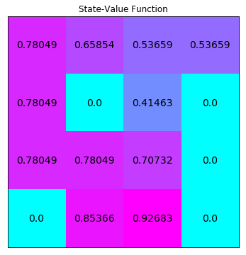

# 迷你项目：动态规划

在此 notebook 中，你将自己编写很多经典动态规划算法的实现。

虽然我们提供了一些起始代码，但是你可以删掉这些提示并从头编写代码。

### 第 0 部分：探索 FrozenLakeEnv

请使用以下代码单元格创建 [FrozenLake](https://github.com/openai/gym/blob/master/gym/envs/toy_text/frozen_lake.py) 环境的实例。


```python
from frozenlake import FrozenLakeEnv

env = FrozenLakeEnv()
```

智能体将会在 $4 \times 4$ 网格世界中移动，状态编号如下所示：

[[ 0  1  2  3]
 [ 4  5  6  7]
 [ 8  9 10 11]
 [12 13 14 15]]

智能体可以执行 4 个潜在动作：


```python
LEFT = 0
DOWN = 1
RIGHT = 2
UP = 3
```

因此，$\mathcal{S}^+ = \{0, 1, \ldots, 15\}$ 以及 $\mathcal{A} = \{0, 1, 2, 3\}$。请通过运行以下代码单元格验证这一点。


```python
# print the state space and action space
print(env.observation_space)
print(env.action_space)

# print the total number of states and actions
print(env.nS)
print(env.nA)
```

    Discrete(16)
    Discrete(4)
    16
    4


动态规划假设智能体完全了解 MDP。我们已经修改了 `frozenlake.py` 文件以使智能体能够访问一步动态特性。 

请执行以下代码单元格以返回特定状态和动作对应的一步动态特性。具体而言，当智能体在网格世界中以状态 1 向左移动时，`env.P[1][0]` 会返回每个潜在奖励的概率和下一个状态。


```python
env.P[1][0]
```


    [(0.3333333333333333, 1, 0.0, False),
     (0.3333333333333333, 0, 0.0, False),
     (0.3333333333333333, 5, 0.0, True)]


每个条目的格式如下所示

prob, next_state, reward, done

其中：
- `prob` 详细说明了相应的  (`next_state`, `reward`) 对的条件概率，以及
- 如果 `next_state` 是终止状态，则 `done` 是 `True` ，否则是 `False`。

因此，我们可以按照以下方式解析 `env.P[1][0]`：
$$
\mathbb{P}(S_{t+1}=s',R_{t+1}=r|S_t=1,A_t=0) = \begin{cases}
               \frac{1}{3} \text{ if } s'=1, r=0\\
               \frac{1}{3} \text{ if } s'=0, r=0\\
               \frac{1}{3} \text{ if } s'=5, r=0\\
               0 \text{ else}
            \end{cases}
$$

你可以随意更改上述代码单元格，以探索在其他（状态、动作）对下环境的行为是怎样的。

### 第 1 部分：迭代策略评估

在此部分，你将自己编写迭代策略评估的实现。

你的算法应该有四个**输入**参数：
- `env`：这是 OpenAI Gym 环境的实例，其中 `env.P` 会返回一步动态特性。
- `policy`：这是一个二维 numpy 数组，其中 `policy.shape[0]` 等于状态数量 (`env.nS`) ， `policy.shape[1]` 等于动作数量 (`env.nA`) 。`policy[s][a]`  返回智能体在状态 `s` 时根据该策略选择动作 `a` 的概率。
- `gamma`：这是折扣率。它必须是在 0 到 1（含）之间的值，默认值为：`1`。
- `theta`：这是一个非常小的正数，用于判断估算值是否足够地收敛于真值函数 (默认值为：`1e-8`）。

该算法会返回以下**输出结果**：
- `V`：这是一个一维numpy数组，其中 `V.shape[0]` 等于状态数量 (`env.nS`)。`V[s]` 包含状态 `s` 在输入策略下的估算值。

请完成以下代码单元格中的函数。


```python
import numpy as np

def policy_evaluation(env, policy, gamma=1, theta=1e-8):
    V = np.zeros(env.nS)
    
    ## TODO: complete the function
    while True:
        delta = 0
        for s in range(env.nS):
            v = 0
            for a in range(env.nA):
                for prob, next_state, reward, done in env.P[s][a]:
                    v += policy[s][a] * prob * (reward + gamma * V[next_state])
            delta = max(delta, np.abs(v - V[s]))
            V[s] = v
        if delta < theta:
            break
    
    return V
```

我们将评估等概率随机策略  $\pi$，其中对于所有 $s\in\mathcal{S}$ 和 $a\in\mathcal{A}(s)$ ，$\pi(a|s) = \frac{1}{|\mathcal{A}(s)|}$。  

请使用以下代码单元格在变量 `random_policy`中指定该策略。


```python
random_policy = np.ones([env.nS, env.nA]) / env.nA
```

运行下个代码单元格以评估等概率随机策略并可视化输出结果。状态值函数已调整形状，以匹配网格世界的形状。


```python
from plot_utils import plot_values

# evaluate the policy 
V = policy_evaluation(env, random_policy)

plot_values(V)
```


运行以下代码单元格以测试你的函数。如果代码单元格返回 **PASSED**，则表明你正确地实现了该函数！ 

**注意：**为了确保结果准确，确保你的 `policy_evaluation` 函数满足上文列出的要求（具有四个输入、一个输出，并且没有更改输入参数的默认值）。


```python
import check_test

check_test.run_check('policy_evaluation_check', policy_evaluation)
```


**<span style="color: green;">PASSED</span>**


### 第 2 部分：通过 $v_\pi$ 获取 $q_\pi$

在此部分，你将编写一个函数，该函数的输入是状态值函数估值以及一些状态 $s\in\mathcal{S}$。它会返回输入状态 $s\in\mathcal{S}$ 对应的**动作值函数中的行**。即你的函数应同时接受输入 $v_\pi$ 和 $s$，并针对所有 $a\in\mathcal{A}(s)$ 返回 $q_\pi(s,a)$。

你的算法应该有四个**输入**参数：
- `env`：这是 OpenAI Gym 环境的实例，其中 `env.P` 会返回一步动态特性。
- `V`：这是一个一维 numpy 数组，其中 `V.shape[0]` 等于状态数量 (`env.nS`)。`V[s]` 包含状态 `s` 的估值。
- `s`：这是环境中的状态对应的整数。它应该是在 `0` 到 `(env.nS)-1`（含）之间的值。
- `gamma`：这是折扣率。它必须是在 0 到 1（含）之间的值，默认值为：`1`。

该算法会返回以下**输出结果**：

- `q`：这是一个一维 numpy 数组，其中 `q.shape[0]` 等于动作数量 (`env.nA`)。`q[a]` 包含状态 `s` 和动作 `a` 的（估算）值。

请完成以下代码单元格中的函数。


```python
def q_from_v(env, V, s, gamma=1):
    q = np.zeros(env.nA)
    
    ## TODO: complete the function
    for a in range(env.nA):
        qa = 0
        for prob, next_state, reward, done in env.P[s][a]:
            qa += prob * (reward + gamma * V[next_state])
        q[a] = qa
    
    return q
```

请运行以下代码单元格以输出上述状态值函数对应的动作值函数。


```python
Q = np.zeros([env.nS, env.nA])
for s in range(env.nS):
    Q[s] = q_from_v(env, V, s)
print("Action-Value Function:")
print(Q)
```

    Action-Value Function:
    [[ 0.0147094   0.01393978  0.01393978  0.01317015]
     [ 0.00852356  0.01163091  0.0108613   0.01550788]
     [ 0.02444514  0.02095298  0.02406033  0.01435346]
     [ 0.01047649  0.01047649  0.00698432  0.01396865]
     [ 0.02166487  0.01701828  0.01624865  0.01006281]
     [ 0.          0.          0.          0.        ]
     [ 0.05433538  0.04735105  0.05433538  0.00698432]
     [ 0.          0.          0.          0.        ]
     [ 0.01701828  0.04099204  0.03480619  0.04640826]
     [ 0.07020885  0.11755991  0.10595784  0.05895312]
     [ 0.18940421  0.17582037  0.16001424  0.04297382]
     [ 0.          0.          0.          0.        ]
     [ 0.          0.          0.          0.        ]
     [ 0.08799677  0.20503718  0.23442716  0.17582037]
     [ 0.25238823  0.53837051  0.52711478  0.43929118]
     [ 0.          0.          0.          0.        ]]


运行以下代码单元格以测试你的函数。如果代码单元格返回 **PASSED**，则表明你正确地实现了该函数！ 

**注意：**为了确保结果准确，确保 `q_from_v` 函数满足上文列出的要求（具有四个输入、一个输出，并且没有更改输入参数的默认值）。


```python
check_test.run_check('q_from_v_check', q_from_v)
```


**<span style="color: green;">PASSED</span>**


### 第 3 部分：策略改进

在此部分，你将自己编写策略改进实现。 

你的算法应该有三个**输入**参数：
- `env`：这是 OpenAI Gym 环境的实例，其中 `env.P` 会返回一步动态特性。
- `V`：这是一个一维 numpy 数组，其中 `V.shape[0]` 等于状态数量 (`env.nS`)。`V[s]` 包含状态 `s` 的估值。
- `gamma`：这是折扣率。它必须是在 0 到 1（含）之间的值，默认值为：`1`。

该算法会返回以下**输出结果**：

- `policy`：这是一个二维 numpy 数组，其中 `policy.shape[0]` 等于状态数量 (`env.nS`) ， `policy.shape[1]` 等于动作数量 (`env.nA`) 。`policy[s][a]`  返回智能体在状态 `s` 时根据该策略选择动作 `a` 的概率。

请完成以下代码单元格中的函数。建议你使用你在上文实现的 `q_from_v` 函数。


```python
def policy_improvement(env, V, gamma=1):
    policy = np.zeros([env.nS, env.nA]) / env.nA
    
    ## TODO: complete the function
    for s in range(env.nS):
        q = q_from_v(env, V, s, gamma)
        policy[s][np.argmax(q)] = 1

    return policy
```

运行以下代码单元格以测试你的函数。如果代码单元格返回 **PASSED**，则表明你正确地实现了该函数！ 

**注意：**为了确保结果准确，确保 `policy_improvement` 函数满足上文列出的要求（具有三个输入、一个输出，并且没有更改输入参数的默认值）。

在继续转到该 notebook 的下个部分之前，强烈建议你参阅 **Dynamic_Programming_Solution.ipynb** 中的解决方案。该函数有很多正确的实现方式！


```python
check_test.run_check('policy_improvement_check', policy_improvement)
```


**<span style="color: green;">PASSED</span>**


### 第 4 部分：策略迭代

在此部分，你将自己编写策略迭代的实现。该算法会返回最优策略，以及相应的状态值函数。

你的算法应该有三个**输入**参数：

- `env`：这是 OpenAI Gym 环境的实例，其中 `env.P` 会返回一步动态特性。
- `gamma`：这是折扣率。它必须是在 0 到 1（含）之间的值，默认值为：`1`。
- `theta`：这是一个非常小的正数，用于判断策略评估步骤是否足够地收敛于真值函数 (默认值为：`1e-8`）。

该算法会返回以下**输出结果**：

- `policy`：这是一个二维 numpy 数组，其中 `policy.shape[0]` 等于状态数量 (`env.nS`) ， `policy.shape[1]` 等于动作数量 (`env.nA`) 。`policy[s][a]`  返回智能体在状态 `s` 时根据该策略选择动作 `a` 的概率。
- `V`：这是一个一维 numpy 数组，其中 `V.shape[0]` 等于状态数量 (`env.nS`)。`V[s]` 包含状态 `s` 的估值。

请完成以下代码单元格中的函数。强烈建议你使用你在上文实现的 `policy_evaluation` 和 `policy_improvement` 函数。


```python
import copy

def policy_iteration(env, gamma=1, theta=1e-8):
    policy = np.ones([env.nS, env.nA]) / env.nA
    
    ## TODO: complete the function
    policy_stable = False
    while not policy_stable:
        V = policy_evaluation(env, policy, gamma, theta)
        policy_prim = policy_improvement(env, V, gamma)
        if policy.all() == policy_prim.all():
            policy_stable = True
        policy = policy_prim

    return policy, V
```

运行下个代码单元格以解决该 MDP 并可视化输出结果。最优状态值函数已调整形状，以匹配网格世界的形状。

**将该最优状态值函数与此 notebook 第 1 部分的状态值函数进行比较**。_最优状态值函数一直都大于或等于等概率随机策略的状态值函数吗？_


```python
# obtain the optimal policy and optimal state-value function
policy_pi, V_pi = policy_iteration(env)

# print the optimal policy
print("\nOptimal Policy (LEFT = 0, DOWN = 1, RIGHT = 2, UP = 3):")
print(policy_pi,"\n")

plot_values(V_pi)
```

    
    Optimal Policy (LEFT = 0, DOWN = 1, RIGHT = 2, UP = 3):
    [[ 1.  0.  0.  0.]
     [ 0.  0.  0.  1.]
     [ 0.  0.  0.  1.]
     [ 0.  0.  0.  1.]
     [ 1.  0.  0.  0.]
     [ 1.  0.  0.  0.]
     [ 1.  0.  0.  0.]
     [ 1.  0.  0.  0.]
     [ 0.  0.  0.  1.]
     [ 0.  1.  0.  0.]
     [ 1.  0.  0.  0.]
     [ 1.  0.  0.  0.]
     [ 1.  0.  0.  0.]
     [ 0.  0.  1.  0.]
     [ 0.  1.  0.  0.]
     [ 1.  0.  0.  0.]] 
    





运行以下代码单元格以测试你的函数。如果代码单元格返回 **PASSED**，则表明你正确地实现了该函数！ 

**注意：**为了确保结果准确，确保 `policy_iteratio` 函数满足上文列出的要求（具有三个输入、两个输出，并且没有更改输入参数的默认值）。


```python
check_test.run_check('policy_iteration_check', policy_iteration)
```


**<span style="color: green;">PASSED</span>**


### 第 5 部分：截断策略迭代

在此部分，你将自己编写截断策略迭代的实现。  

首先，你将实现截断策略评估。你的算法应该有五个**输入**参数：
- `env`：这是 OpenAI Gym 环境的实例，其中 `env.P` 会返回一步动态特性。
- `policy`：这是一个二维 numpy 数组，其中 `policy.shape[0]` 等于状态数量 (`env.nS`) ， `policy.shape[1]` 等于动作数量 (`env.nA`) 。`policy[s][a]`  返回智能体在状态 `s` 时根据该策略选择动作 `a` 的概率。
- `V`：这是一个一维 numpy 数组，其中 `V.shape[0]` 等于状态数量 (`env.nS`)。`V[s]` 包含状态 `s` 的估值。
- `max_it`：这是一个正整数，对应的是经历状态空间的次数（默认值为：`1`）。
- `gamma`：这是折扣率。它必须是在 0 到 1（含）之间的值，默认值为：`1`。

该算法会返回以下**输出结果**：
- `V`：这是一个一维 numpy 数组，其中 `V.shape[0]` 等于状态数量 (`env.nS`)。`V[s]` 包含状态 `s` 的估值。

请完成以下代码单元格中的函数。


```python
def truncated_policy_evaluation(env, policy, V, max_it=1, gamma=1):
    
    ## TODO: complete the function
    counter = 0
    while counter < max_it:
        for s in range(env.nS):
            v = 0
            for a in range(env.nA):
                for prob, next_state, reward, done in env.P[s][a]:
                    v += policy[s][a] * prob * (reward + gamma * V[next_state])
            V[s] = v
        counter += 1
    
    return V
```

接着，你将实现截断策略迭代。你的算法应该接受四个**输入**参数：
- `env`：这是 OpenAI Gym 环境的实例，其中 `env.P` 会返回一步动态特性。
- `max_it`：这是一个正整数，对应的是经历状态空间的次数（默认值为：`1`）。
- `gamma`：这是折扣率。它必须是在 0 到 1（含）之间的值，默认值为：`1`。
- `theta`：这是一个非常小的正整数，用作停止条件（默认值为：`1e-8`）。

该算法会返回以下**输出结果**：
- `policy`：这是一个二维 numpy 数组，其中 `policy.shape[0]` 等于状态数量 (`env.nS`) ， `policy.shape[1]` 等于动作数量 (`env.nA`) 。`policy[s][a]`  返回智能体在状态 `s` 时根据该策略选择动作 `a` 的概率。
- `V`：这是一个一维 numpy 数组，其中 `V.shape[0]` 等于状态数量 (`env.nS`)。`V[s]` 包含状态 `s` 的估值。

请完成以下代码单元格中的函数。


```python
def truncated_policy_iteration(env, max_it=1, gamma=1, theta=1e-8):
    V = np.zeros(env.nS)
    policy = np.zeros([env.nS, env.nA]) / env.nA
    
    ## TODO: complete the function
    while True:
        policy = policy_improvement(env, V, gamma)
        V_old = V.copy()
        V = truncated_policy_evaluation(env, policy, V, max_it, gamma)
        
        if max(np.abs(V - V_old)) < theta:
            break
    
    return policy, V
```

运行下个代码单元格以解决该 MDP 并可视化输出结果。状态值函数已调整形状，以匹配网格世界的形状。

请实验不同的 `max_it` 参数值。始终都能获得最优状态值函数吗？


```python
policy_tpi, V_tpi = truncated_policy_iteration(env, max_it=2)

# print the optimal policy
print("\nOptimal Policy (LEFT = 0, DOWN = 1, RIGHT = 2, UP = 3):")
print(policy_tpi,"\n")

# plot the optimal state-value function
plot_values(V_tpi)
```

    
    Optimal Policy (LEFT = 0, DOWN = 1, RIGHT = 2, UP = 3):
    [[ 1.  0.  0.  0.]
     [ 0.  0.  0.  1.]
     [ 0.  0.  0.  1.]
     [ 0.  0.  0.  1.]
     [ 1.  0.  0.  0.]
     [ 1.  0.  0.  0.]
     [ 1.  0.  0.  0.]
     [ 1.  0.  0.  0.]
     [ 0.  0.  0.  1.]
     [ 0.  1.  0.  0.]
     [ 1.  0.  0.  0.]
     [ 1.  0.  0.  0.]
     [ 1.  0.  0.  0.]
     [ 0.  0.  1.  0.]
     [ 0.  1.  0.  0.]
     [ 1.  0.  0.  0.]] 
    


运行以下代码单元格以测试你的函数。如果代码单元格返回 **PASSED**，则表明你正确地实现了该函数！ 

**注意：**为了确保结果准确，确保 `truncated_policy_iteration` 函数满足上文列出的要求（具有四个输入、两个输出，并且没有更改输入参数的默认值）。


```python
check_test.run_check('truncated_policy_iteration_check', truncated_policy_iteration)
```


**<span style="color: green;">PASSED</span>**


### 第 6 部分：值迭代

在此部分，你将自己编写值迭代的实现。

你的算法应该接受三个输入参数：
- `env`：这是 OpenAI Gym 环境的实例，其中 `env.P` 会返回一步动态特性。
- `gamma`：这是折扣率。它必须是在 0 到 1（含）之间的值，默认值为：`1`。 
- `theta`：这是一个非常小的正整数，用作停止条件（默认值为：`1e-8`）。

该算法会返回以下**输出结果**：
- `policy`：这是一个二维 numpy 数组，其中 `policy.shape[0]` 等于状态数量 (`env.nS`) ， `policy.shape[1]` 等于动作数量 (`env.nA`) 。`policy[s][a]`  返回智能体在状态 `s` 时根据该策略选择动作 `a` 的概率。
- `V`：这是一个一维 numpy 数组，其中 `V.shape[0]` 等于状态数量 (`env.nS`)。`V[s]` 包含状态 `s` 的估值。


```python
def value_iteration(env, gamma=1, theta=1e-8):
    V = np.zeros(env.nS)
    
    ## TODO: complete the function
    while True:
        delta = 0
        for s in range(env.nS):
            v_max = 0
            for a in range(env.nA):
                v = 0
                for prob, next_state, reward, done in env.P[s][a]:
                    v += prob * (reward + gamma * V[next_state])
                v_max = max(v_max, v)
            delta = max(delta, np.abs(V[s] - v_max))
            V[s] = v_max
        
        if delta < theta:
            break
    
    policy = policy_improvement(env, V, gamma)
    
    return policy, V
```

运行下个代码单元格以解决该 MDP 并可视化输出结果。状态值函数已调整形状，以匹配网格世界的形状。


```python
policy_vi, V_vi = value_iteration(env)

# print the optimal policy
print("\nOptimal Policy (LEFT = 0, DOWN = 1, RIGHT = 2, UP = 3):")
print(policy_vi,"\n")

# plot the optimal state-value function
plot_values(V_vi)
```

    
    Optimal Policy (LEFT = 0, DOWN = 1, RIGHT = 2, UP = 3):
    [[ 1.  0.  0.  0.]
     [ 0.  0.  0.  1.]
     [ 0.  0.  0.  1.]
     [ 0.  0.  0.  1.]
     [ 1.  0.  0.  0.]
     [ 1.  0.  0.  0.]
     [ 1.  0.  0.  0.]
     [ 1.  0.  0.  0.]
     [ 0.  0.  0.  1.]
     [ 0.  1.  0.  0.]
     [ 1.  0.  0.  0.]
     [ 1.  0.  0.  0.]
     [ 1.  0.  0.  0.]
     [ 0.  0.  1.  0.]
     [ 0.  1.  0.  0.]
     [ 1.  0.  0.  0.]] 
    


运行以下代码单元格以测试你的函数。如果代码单元格返回 **PASSED**，则表明你正确地实现了该函数！ 

**注意：**为了确保结果准确，确保 `truncated_policy_iteration` 函数满足上文列出的要求（具有三个输入、两个输出，并且没有更改输入参数的默认值）。


```python
check_test.run_check('value_iteration_check', value_iteration)
```


**<span style="color: green;">PASSED</span>**


```python

```
